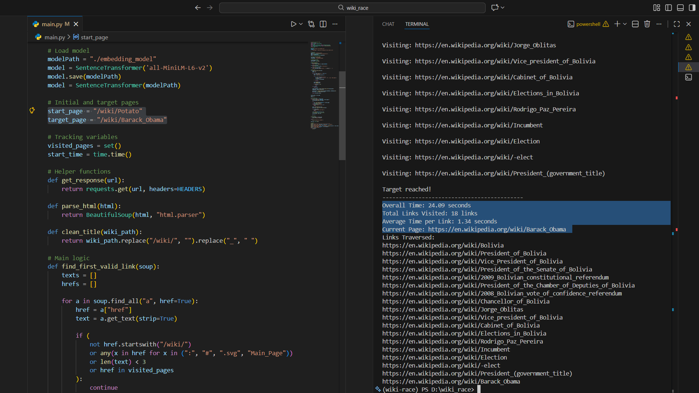

# Wikirun
This project implements an intelligent Wikipedia crawler that navigates from one article to another using semantic similarity instead of random or rule-based link selection.

This fun project was inspired from Green Code.

>Results:

